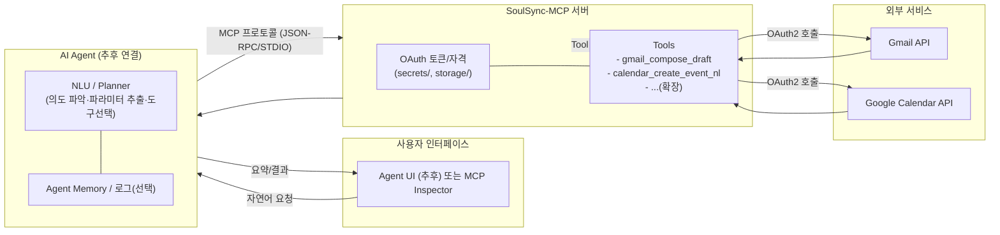
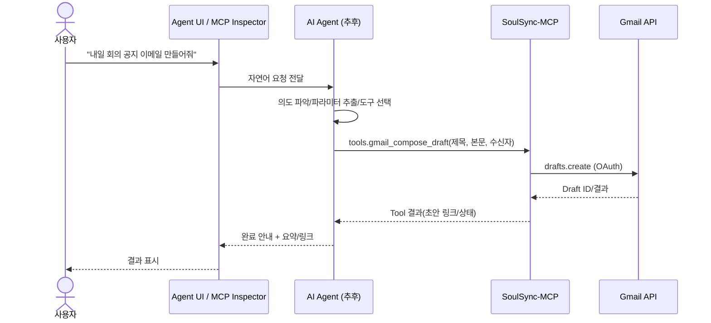
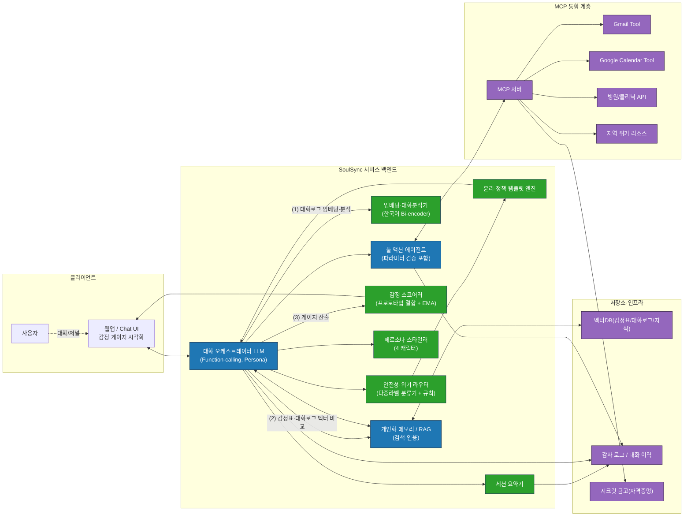

# 로컬 실행 가이드 ( MCP : Google Calendar + Gmail )

### 요구사항
- Python 3.10+ (권장 3.11)
- Node.js LTS (npx 사용) → `node -v` `npm -v` 버전 확인

## 1) 가상환경설정

1) 레포 폴더로 이동
   
   `cd C:\SoulSync-MCP`

2) 가상환경 생성/활성화
   
   `python -m venv .venv`

   `.\.venv\Scripts\Activate.ps1`

3) 패키지 설치

   `pip install -U pip`

   `pip install -r requirements.txt`

## 2) Flow Chart

## 3) Google Cloud 설정 ( Calendar & Gmail )

#### 3-1) API 활성화
- Google Cloud Console → API 및 서비스 → 라이브러리
- Google Calendar API
- Gmail API
- 추후 필요한 API enable하여 추가
  
#### 3-2) OAuth 동의화면
- 사용자 유형 : 외부(External). 개인이 사용할 경우
- 게시 상태: 테스트 중(Testing)
- 테스트 사용자: 본인 Gmail 추가 → 저장
- Scope 설정

  아래 사진과 같이 설정
  
  

  '범위 추가 또는 삭제' 선택

   Calendar: https://www.googleapis.com/auth/calendar.events

   Gmail: https://www.googleapis.com/auth/gmail.compose
  
  
  
#### 3-3) OAuth 클라이언트 ID
- API 및 서비스 → 사용자 인증 정보
- OAuth 클라이언트 ID 만들기
- **애플리케이션 유형 : 데스크톱 앱** - JSON 최상위 키 "installed" ( 유형 따라 다르나, 현재 개발한 프로젝트 상에서는 앱으로만 작동 )
- 생성 후 **JSON 다운로드** 후 이름 변경하여 secrets 폴더에 저장 : gcal_credentials.json / gmail_credentials.json

  
## 4) OAuth 토큰 발급

1) venv 활성화 상태에서 명령어 입력

- Gmail 초안 작성

   `python -c "from src.mcp_server.auth import ensure_credentials; from src.mcp_server.config import GMAIL_CREDENTIALS_PATH, GMAIL_TOKEN_PATH, GMAIL_SCOPES; c=ensure_credentials(GMAIL_CREDENTIALS_PATH, GMAIL_TOKEN_PATH, GMAIL_SCOPES); print('GMAIL token ->', GMAIL_TOKEN_PATH); print('Scopes:', getattr(c,'scopes',None))"`

- Gmail 전송

   `python -c "import base64;from email.mime.text import MIMEText;from googleapiclient.discovery import build;from google_auth_oauthlib.flow import InstalledAppFlow;from google.oauth2.credentials import Credentials;from email.utils import formataddr;from email.header import Header;import os;CREDS='secrets/gmail_credentials.json';TOKEN='storage/gmail_token.json';SCOPES=['https://www.googleapis.com/auth/gmail.compose'];creds=None;import pathlib
if os.path.exists(TOKEN): creds=Credentials.from_authorized_user_file(TOKEN, SCOPES)
if not creds or not creds.valid or not set(SCOPES).issubset(set(getattr(creds,'scopes',[]) or [])):
    flow=InstalledAppFlow.from_client_secrets_file(CREDS, SCOPES);creds=flow.run_local_server(port=0);open(TOKEN,'w',encoding='utf-8').write(creds.to_json())
service=build('gmail','v1',credentials=creds)
msg=MIMEText('한 줄 테스트 본문입니다.','plain','utf-8')
msg['To']=formataddr((str(Header('받는사람','utf-8')),'your.real.address@gmail.com'))
msg['Subject']=str(Header('한 줄 테스트','utf-8'))
raw=base64.urlsafe_b64encode(msg.as_bytes()).decode('utf-8')
print(service.users().messages().send(userId='me',body={'raw':raw}).execute())"`

   your.real.address@gmail.com에 실제 이메일 주소값 작성. 바로 전송됨.
  
- Gcal

   `python -c "from src.mcp_server.auth import ensure_credentials; from src.mcp_server.config import GCAL_CREDENTIALS_PATH, GCAL_TOKEN_PATH, GCAL_SCOPES; c=ensure_credentials(GCAL_CREDENTIALS_PATH, GCAL_TOKEN_PATH, GCAL_SCOPES); print('GCAL token ->', GCAL_TOKEN_PATH); print('Scopes:', getattr(c,'scopes',None))"`
 
2) 팝업창으로 뜨는 링크에서 권한 확인

3) storage폴더에 `gcal_token.json` / `gmail_token.json` 생성됨
   

## 5) MCP Inspector 실행 ( STDIO 연결 )
#### 5-1) Inspector 켜기
- 실행 전, Node.js 설치
  
   `npx @modelcontextprotocol/inspector`

#### 5-2) 연결 설정 (좌측 패널)
- Transport Type : `STDIO`
- Command : `C:\SoulSync-MCP\.venv\Scripts\python.exe`
- Arguments : `run_mcp_stdio.py`
- Working Directory : `C:\SoulSync-MCP`
- Environment Variables
  
  `GCAL_CREDENTIALS_PATH` = `secrets/gcal_credentials.json`
  
  `GMAIL_CREDENTIALS_PATH` = `secrets/gmail_credentials.json`
  
  `GCAL_TOKEN_PATH`       = `storage/gcal_token.json`
  
  `GMAIL_TOKEN_PATH`      = `storage/gmail_token.json`
  
  `TZ`                    = `Asia/Seoul`

좌상단 Connect(▶) → 왼쪽에 Tools 목록이 보이면 연결 완료.

## 6) Tool Test

#### 6-1) Calender_create_event_nl

     datetime_text: `2025-08-27 15:00`
  
     duration_min: `60`
  
     reason: `불안 관리 세션`
  
     timezone: `Asia/Seoul`
     
   Run Tool → id, htmlLink 확인

#### 6-2) gmail_compose_draft

     to: `you@example.com`
  
     subject: `TEST`
  
     body: `test`
  
   Run Tool → 초안 id, messageId 확인

---

## 7) Mail 보내기 Flow Chart

## *) 구상도도

## *) 트러블슈팅

- `redirect_uri_mismatch` : 웹(Web) 클라이언트 JSON 사용 - GCP에서 데스크톱 앱(Installed) 으로 새로 만들고 `secrets/*.json` 교체

- `403 access_denied` : 동의화면에 계정 미등록 - 테스트 사용자에 본인 Gmail 추가

- `insufficientPermissions` : 토큰 스코프 부족 - `storage/*token.json 삭제` → 토큰 재승인

   ( 권한 꼬임 해소 Tip - `https://myaccount.google.com/permissions` 에서 기존 앱 권한 제거 → token.json 삭제 → 토큰 재승인 )

- `secrets/` `storage/*token.json` `.gitignore` Commit 금지

- JSON/토큰 교체 후에는 Inspector종료 후, 다시 시작
